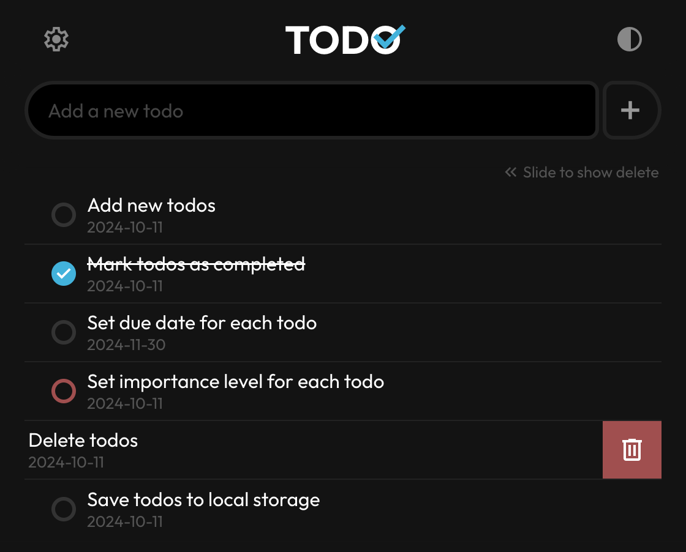

# Todo List

A simple to-do list PWA built with React and SCSS.

## Features

- Add new todos
- Mark todos as completed
- Set due date for each todo
- Set importance level for each todo
- Delete todos
- Save todos to local storage

## Installation

### iOS

1. Use Safari to open TODO website: <https://johnlin10.github.io/to-do-list/>

2. Click the share icon in the address bar  

3. Tap "Add to Home Screen"  

4. Tap "Add"  

5. TODO is added to your home screen  

